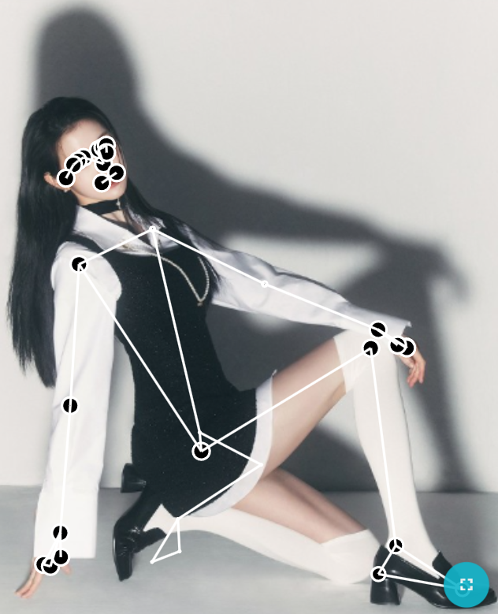
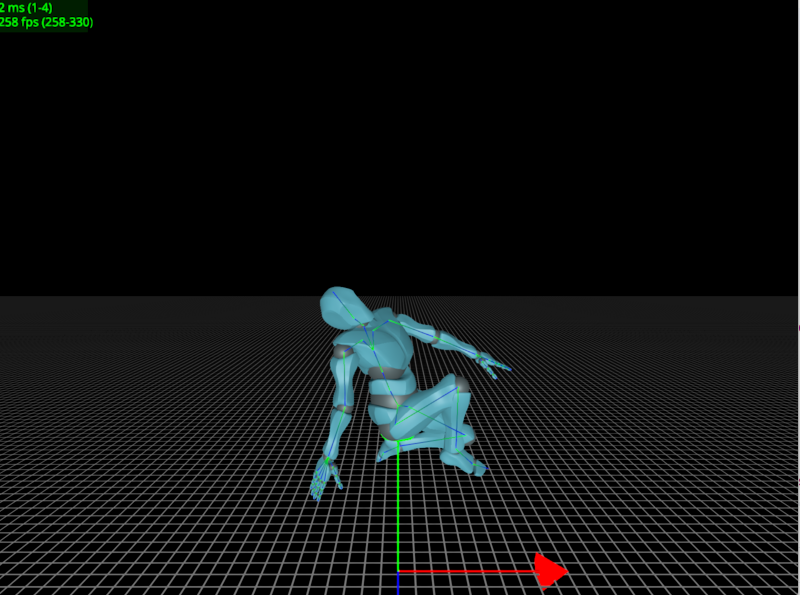
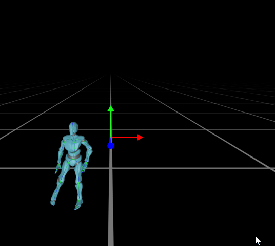

# PyMotionViewer 🏃‍♂️

[](https://opensource.org/licenses/MIT)
[](https://www.python.org/)
[-green)](https://github.com/pygfx/pygfx)

**A Lightweight, WGPU-based Real-time Visualization Framework for 3D Human Motion in Python.**

**PyMotionViewer** fills the gap between simple 2D plots (Matplotlib) and heavy game engines (Unity/UE) for computer vision researchers. It enables high-fidelity, real-time rendering of 3D human motion (from MediaPipe, SMPL, WHAM, etc.) directly in your Python environment.

---

## 📸 Gallery & Demos

### 1. Real-time Pose Retargeting (MediaPipe)
Mapping 2D/3D sparse landmarks from a single image to a full Mixamo character skeleton using our analytical retargeting algorithm.

| Input Source | MediaPipe Detection | **PyMotionViewer Result** |
| :---: | :---: | :---: |
|  |  |  |
| *Original Image* | *Pose Landmarks* | *Real-time WGPU Render* |

### 2. Motion Capture Visualization (WHAM/SMPL)
Visualizing complex motion data (PKL files) generated by state-of-the-art algorithms like [WHAM](https://github.com/yohanshin/WHAM).

| Original Video | Algorithm Overlay (SMPL) | **PyMotionViewer Result** |
| :---: | :---: | :---: |
|  |  |  |
| *Input Video* | *WHAM Mesh Overlay* | *Retargeted on Mixamo Character* |

---

## ✨ Key Features

* **🚀 Lightweight & Fast**: Built on `pygfx` (WGPU), offering next-gen graphics performance without the overhead of Unity or Blender.
* **🐍 Pure Python**: seamlessly integrates into your existing PyTorch/TensorFlow research workflow.
* **☠️ Universal Retargeting**: Features a custom vector-algebra-based retargeting engine that maps sparse landmarks (MediaPipe) or rotation matrices (SMPL) to standard bone structures.
* **🛠 Easy to Extend**: decoupled architecture allows easy integration with HMR2.0, 4D-Humans, or custom motion datasets.

## 📦 Installation

```bash
git clone [https://github.com/fangbo234/PyMotionViewer.git](https://github.com/fangbo234/PyMotionViewer.git)
cd PyMotionViewer

# Install dependencies
pip install -r requirements.txt
